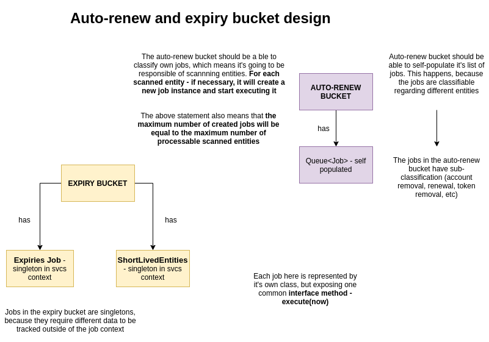
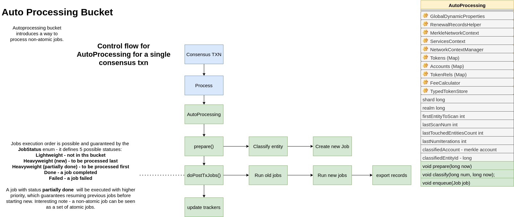
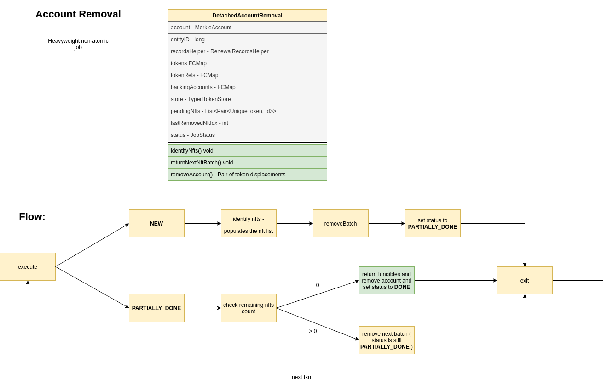
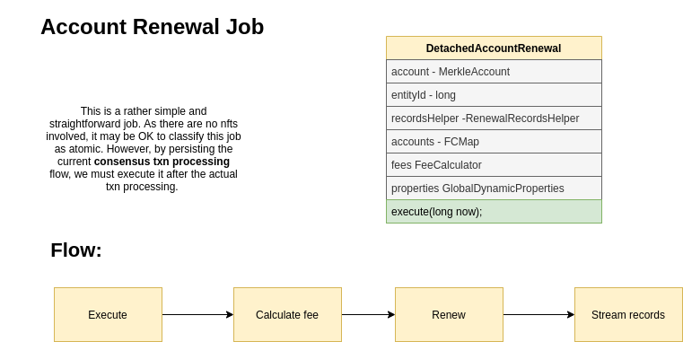
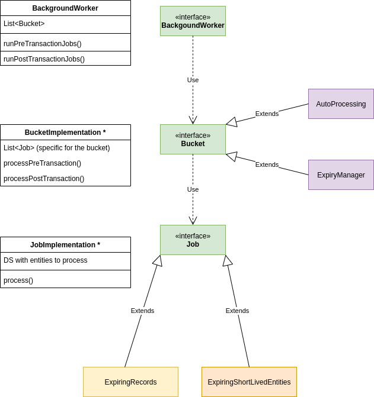

# Entity Renewal and Expiry Framework

Currently, the hedera services node has one way of expiring/renewing entities, which is not flexible. At the moment of writing, it supports records, scheduled transactions (lightweight entities) and account expiration/renewal. There is no expiration for tokens/topics, etc.

We're considering the following logical framework in order to support a more generic expiration handling, with those **main** elements: 

## Background Worker:

The background worker is hedera's vision of background process - a process which is executed often enough. The current expiries/renewals are triggered on each transaction. They can be split into 2 types - atomic  and non-atomic.
The background worker is responsible for executing each set of jobs pre- and post-transaction. This is possible because of the bucket abstraction.
The `HederaBackgroundWorker` will be a singleton, and will have 2 important methods:
- `executePreTransactionJobs` - where the jobs are atomic. We can also prepare other jobs before the actual transaction processing, and process them after the transaction.
- `executePostTransactionJobs` - where the jobs are not atomic, and may span in multiple transactions.
Both methods will iterate over the buckets and execute the said jobs in the bucket.
May be configured to utilize dynamic `Capacity` configuration for the work done, regarding heavy entities.
```java
interface BackgroundWorker {
	void doPreTransactionJobs(long now);
	void doPostTransactionJobs(long now); // can use the Capacity config
}
```

## Bucket:
The bucket is a logical group of executable tasks - jobs, grouped by common functionality. A bucket's responsibility may be lightweight entities, or heavyweight.

For migrating the current expiry/renewal, we must consider 2 types of bucket - `ExpiryManager` and `AutoProcessing` . The expiry bucket will be responsible of handling scheduled txns and txn records, while the auto-processing - expiry/renewal of tokens and accounts.
By having the bucket abstraction, it is possible to define expiration or renewal for more entities - we're not limited to tokens/accounts.
Each bucket should also be a singleton, but it's implementation regarding `job` organization and execution may vary a bit.
```java

interface Bucket {
    /* Uses internal Capacity config. See below on Configuration section. */
    void doPreTransactionJobs(long now);
    void doPostTransactionJobs(long now);
}
```
## Job:
A job is an abstraction of an executable task which should be performed in order to expire/renew an entity. The `Job` interface exposes a single method:
```java
interface Job {
	boolean execute(long now);
}
```
which is responsible for handling all the business logic of the job.
Each job should be scoped to a single entity, or a set of **related** entities. We can assume there are 2 types of jobs - atomic and non-atomic. 

**Each job should be represented by a different class, with it's business logic located in the `execute` method**.

The atomic jobs can be handled in the scope of a single consensus transaction. They represent `lightweight` entities, which the system no longer requires
transaction records and expired scheduled transactions.

The non-atomic jobs represent a heavy operation, or an operation cast upon a `heavyweight` entity.
This operation may span in multiple transactions. Example of such scenario - removing an expired account, which owns 10k unique tokens.

It's important to note that jobs should be classifiable by more than 1 criterion. Each job should:
- have a progress status - `DONE`, `FAILED`, `HEAVYWEIGHT_NEW`, `HEAVYWEIGHT_PARTIALLY_DONE`, `LIGHTWEIGHT`.
- have a classification, regarding the entity - `LIGHTWEIGHT` or `HEAVYWEIGHT`.

By implementing the `Job` interface properly, we are given absolute freedom to expire/renew/execute whatever "background" operation we need in the future.

## Events, which require jobs:
* `Records Expiration` - old transaction records must be removed. This can be handled in single txn.

* `Scheduled Transaction Expiration` - expired scheduled txns must be removed. This can also be handled in a single txn.

* `Account Expiration` - expired accounts are classified as renewable or not. 
The second type should be handled by clearing all relations to tokens, returning balances to treasuries and finally- deleting the account.
**Problem:** the account may own `Unique` tokens. In this case, we cannot transfer all the balance in single transaction.

* `Account Renewal` - expired accounts with balance - Renewable accounts. If the balance is sufficient, the account is enabled again. 

* `Token Expiration` - requires removing the NFTs from state, dissociating from accounts, dissociating from treasury, removing the token from state.


## Configuration:
We have a wide variety of parameters to configure, regarding job execution. We've synthesised this list:
- Max heavyweight jobs per txn - includes both old and new
- Max entities to touch per job ( like max nfts to remove per `DetachedAccountRemoval.execute(now)` invocation )
- Max entities to scan ( present in `GlobalDynamicProperties` )
- ...

The buckets/worker can be enhanced with `Capacity` dynamic configuration, like:
```java
interface Capacity {
  int entityTouches();
  int entityMutations();
}
```
where `Capacity` may be based on the current usage level of the `CryptoTransfer` throttle (example). This is being explored now.

## Specific documentation of current buckets:


### `ExpiryManager` 
- Responsible for executing jobs, related to lightweight expiry (pre-transaction jobs).
- The jobs of the `ExpiryManager` are singletons, as those jobs need to track entities - they are required in other scopes, except for the bucket.


### `AutoProcessing` 
- Responsible for executing jobs, related to heavyweight entities - renewal/expiration of accounts and tokens (and possibly more).
- The jobs here are not singletons, but rather instantiated for a single entity by the bucket itself.
- They are instantiated upon scanning, where entities are classified based on their expiration status - `DETACHED_ACCOUNT_GRACE_PERIOD_OVER` or `EXPIRED_ACCOUNT_READY_TO_RENEW`.
- A separate job class will represent each entity handling operation. After scanning, jobs are queued and later executed.


## Specific documentation of current jobs:
### Light:
- `ExpiringRecords` - singleton. Responsible for handling old transaction records. Tracks entities in `InitializationFlow` and `ExpiringCreations`. Holds a `MonotonicFullQueueExpiries<Long>` data structure for records.
- `ExpiringShortLivedEntities` singleton. Responsible for handling expiration of scheduled transactions. Tracks entities in `InitializationFlow` and `TxnAwareRecordsHistorian`. Holds a `PriorityQueueExpiries` for expirable entities.

### Heavy:
#### `DetachedAccountRemoval`
- Instantiated by `AutoProcessing` bucket. Gets all the data structures it requires to from the bucket. It gets assinged a classified entity to work on. Utilizes `RenewalRecordsHelper` to export transaction records.
- Responsible for removing an expired account, removing token relationships and returning balance to treasury. **Only fungible tokens are considered at the time of writing**.
- Non-atomic design must be considered if the account owns nfts, similar to the `TokenExpiration` design.


#### `DetachedAccountRenewal`
- Instantiated by `AutoProcessing`, the same way as `DetachedAccountRemoval`. Responsible for the renewal process for an expired account.


#### `TokenExpiration` 
- not yet implemented.
- Design: Identify all nfts to be deleted -> delete nfts (in multiple txns) -> dissociate from any accounts (and treasury) -> remove from `FCMap` 

## Higher-level diagrams and visual documentation:

### Expiry flow:


### Worker - bucket - job hierarchy:
