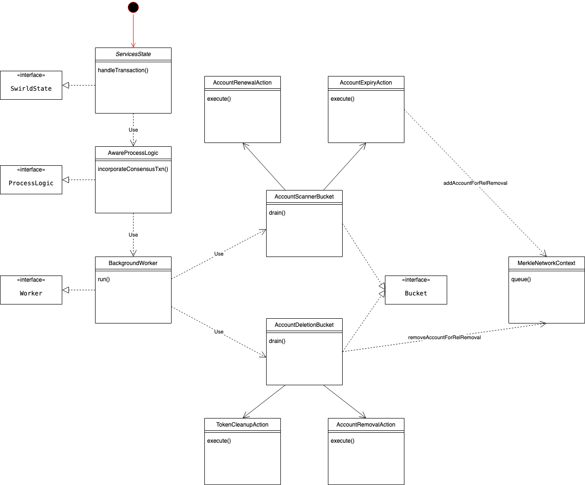
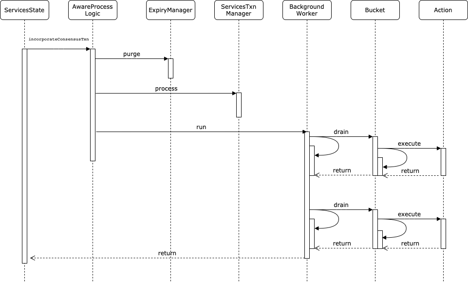

# Entity Renewal and Expiry Design

## Overview

Currently, Hedera services node has one way of expiring/renewing entities, which is not flexible. At the moment of
writing, it supports records, scheduled transactions and account expiration/renewal. During the process of transaction
handling there are two business logics that currently happen before and after the actual transaction processing:

- `Before`: Purging any references to expired entities (records and schedules)
- `After`: AutoRenewal execution of accounts

From design point of view there are no issues reported during the purging phase of Hedera transaction handling process.
However there is no expiration for tokens/topics and proper handling of NFTs. This proposal design shows the new
architecture behind AutoRenewal of accounts and its capabilities to be used for tokens (fungible and non-fungible)
expiry and auto renewal. We're considering the following logical framework in order to support a more generic expiration
handling, with those **main** elements:

-------------

### Worker

The worker is Hedera's vision of a background process - a process which is executed often enough. The current
expiries/renewals for accounts are triggered on each transaction. The background worker is responsible for executing all
actions during the post-transaction phase. This is possible because of the bucket abstraction implied.

Below is `Worker` functional interface:

```java
interface Worker {
  boolean run(long consensusTimeStamp);
}
```

This method implementation will iterate over all buckets and execute the determined actions. The worker will also pass
the available network capacity through the Throttling system to each bucket.

#### Worker algorithm

1. Calculate worker available capacity based on system throttling load
2. Allocate capacity to each buckets
3. Drain capacity from each bucket
4. Every bucket executes actions till it exhausts its capacity

-------------

### Bucket

The bucket is a logical group of executable actions, grouped by common functionality. A bucket's responsibility may be
account scanner and deletion. New buckets can be introduced in future for token scanning and removal.

For migrating the current expiry/renewal account implementation, we might consider 2 types of buckets

- `AccountScannerBucket` and `AccountDeletionBucket`.

Below is `Bucket` functional interface:

```java
interface Bucket {
	/* Returns the capacity used by this work. */
	Capacity drain(long consensusTimeStamp, Capacity available);
}
```

The implementation `AccountScannerBucket` will be responsible for:

- iteration over all merkle accounts
- for every iteration (entity touch) the capacity will be depleted
- determination of action for each account loaded from state. The returned actions must be only for scanning purposes.
  For instance if account must be renewed, `Renew` action will be returned
- action execution

Pseudo code of the drain method:

````java
class AccountScannerBucket {
	public Capacity drain(long consensusTimeStamp, Capacity available) {
		while (hasEnoughCapacity(available)) {
			MerkleAccount account = loadAccount(++lastScannedEntity);
			/* Returns AccountRenewAction or AccountExpiryAction for now */
			Option<Action> action = determineAction(account, now);

			if (!action.isEmpty() && hasAvailableCapacity(availability, action.requiredCapacity())) {
              			action.execute();
              			availability -= action.requiredCapacity() + action.requiredCapacity() * throttleLoad();
              			lastScannedEntity = accountNum;
			}
		}

		return available;
	}
}
````

The implementation of `AccountDeletionBucket` will be responsible for:

- iteration over all account relations
- for every iteration (entity touch) the capacity will be depleted
- determination of action for each merkle account loaded from state
- action execution
- removal of account from `MerkleNetworkContext` queue

Pseudo code of the drain method:

````java
class AccountDeletionBucket {
  public Capacity drain(long consensusTimeStamp, Capacity available) {
    while (hasEnoughCapacity(available)) {
      EntityId accountId = getNextAccountForProcessing();
      MerkleAccount merkleAccount = accounts.get(accountId);
			
			/* Returns AccountRemovalAction if no token rels are existing
			Returns TokenCleanupAction if token relation is existing */
      Action action = determineAction(merkleAccount);

      if (hasAvailableCapacity(availability, action.requiredCapacity())) {
        action.execute();
        available -= action.requiredCapacity();
				/* we remove it from MerkleNetworkContext queue for relationship removals
				 so we do not process the same account again. The work for this entity is done*/
        if (action instanceof AccountRemovalAction) {
          merkleNetworkContext.removeAccountForRelRemoval(accountNum);
        }
      }
    }

    return available;
  }
}
````

-------------

### Action

An action is an abstraction of an executable task (business logic) which should be performed in order to expire/renew an
account in atomic way. Each action should be scoped to a single entity. Some actions will be too time consuming to be
executed as part of Hedera transaction. An example for that is an account that has expired and the grace period has
passed.

For migrating the current expiry/renewal account implementation, we might consider 3 types of actions
- `AccountExpiryAction`, `AccountRenewAction`, `AccountRemovalAction` and `TokenCleanupAction`.

Below is `Action` functional interface:

```java
interface Action {
	/* Returns the required capacity of the Action */
	Capacity requiredCapacity();

	/* Performs the action */
	void execute();
}
```

The implementation `AccountExpiryAction` will be responsible for:

- add account for reletationship removal to `MerkleNetworkContext` new `Queue<AccountNum>`

Pseudo code of execute method:

````java
class AccountExpiryAction {
  public execute() {
		merkleNetworkContext.addAccountForRelRemoval(accountNum);
	}
}
````

The implementation `AccountRemovalAction` will be responsible for:

- removal from `FCMap<MerkleEntityId, MerkleAccount> accounts`
- remove account from `MerkleNetworkContext` new `Queue<AccountNum>`

Pseudo code of execute method:

````java
class AccountRemovalAction {
	public execute() {
		FCMap<MerkleEntityId, MerkleAccount> accounts = getAccounts();
		accounts.remove(accountNum);
	}
}
````

The implementation `TokenCleanupAction` will be responsible for:

- iterate over account tokens while checking for available capacity
- retrieving Merkle token
- send token from account to treasury
- remove account to token association
- delete token from FCMap

Pseudo code of execute method:

````java
class TokenCleanupAction {
	public execute() {
		long tokenId = merkleAccount.tokens().getRawIds()[0];
		MerkleToken token = tokens().get(tokenId);
		transferToken(accountId, treasury);
		MerkleEntityAssociation mea = new MerkleEntityAssociation(accountId, tokenId);
		tokenAssociations().remove(mea);
		merkleAccount.tokens().remove(0);
	}
}
````

-------------

### Capacity

The throttling system provides information on the current Hedera transaction load of the network. We can assume that the capacity from the throttle can be used to determine how much capacity the worker should have. When the usage of the throttle increases, the worker's
capacity should decrease accordingly. The capacity of the worker will be split into the buckets and each bucket can and will have different capacity assigned to it (in temrs of proportions). It's important to allocate more capacity to some buckets compared to others in order to process background work accordingly.

Below is the `Capacity` functional interface:

```java
interface Capacity {
  long available();
}
```

The worker will get information on how much congestion is there in the network based on the Throttling system. The congestion will be translated to how much (in terms of %) the network is utilised. The minimum utilisation of the network can be considered 1 TPS and max utilisation can be considered when the Thottles are being reached (f.e 10k TPS for CryptoTransfers).

State read and update operations will have an assigned value that will be used to represent computational time. For example `read` operations cost `1` capacity and write operations cost `5` capacity. 

The worker will have a property `MAX_CAPACITY` (f.e `1000`), that is a number corresponding to the maximum amount of work the Worker can perform during `handleTransaction` **if there is 1 TX/sec** load in the system.

The actual `capacity` that the worker will use will be calculated based on how much the network is congested. If the network is utilised at 30%, theoretically the worker can use 70% of the `MAX_CAPACITY` -> `700 units`.

The worker will assing proportions of the availableCapacity to the buckets. F.e 20% on AccountScanning and 80% on AccountDeletion bucket.

#### Buckets

| Bucket                | Description                                              	  	    | capacity            |
|-----------------------|---------------------------------------------------------------------------|---------------------|
| AccountScannerBucket  | Iterates through Merkle Accounts and determines an action to be performed | 20% worker capacity |
| AccountDeletionBucket | Iterates through Merkle Accounts and clears token relations. Removes account from state once all relations are cleared| 80% worker capacity |

#### Actions

| Action               	| Bucket                	| Description                                                                                                           	| Required Capacity         	|
|----------------------	|-----------------------	|-----------------------------------------------------------------------------------------------------------------------	|---------------------------	|
| AccountRenewAction   	| AccountScannerBucket  	| Charges the renewal account if expiry time has occurred.                                                              	| `N1=x1 reads + y1 writes` 	|
| AccountExpiryAction  	| AccountScannerBucket  	| Adds the Entity Id into a queue in the MerkleNetworkContext in order to be processed by the AccountDeletionBucket     	| `N2=x2 reads + y2 writes` 	|
| TokenCleanupAction   	| AccountDeletionBucket    	| Gets next Token Relation for a given `account`, transfers the tokens to the `treasury` and removes the token relation 	| `N3=x3 reads + y3 writes` 	|
| AccountRemovalAction 	| AccountDeletionBucket 	| Removes the FCMap entry for a given `account`                                                                         	| `N4=x4 reads + y4 writes` 	|

### Current UML class diagram


-------------

### New Design UML class diagram



-------------

### UML sequence diagram


